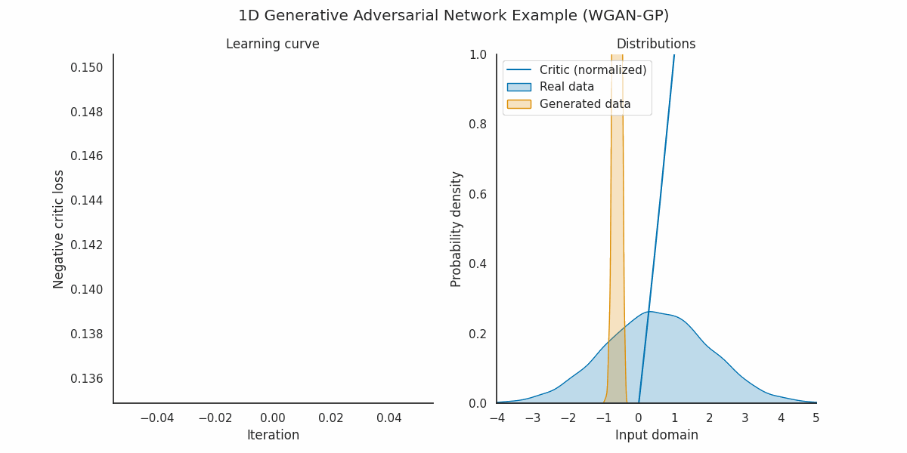
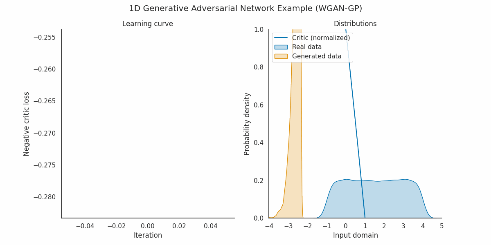

# WassersteinGANTest_1D
### Reproduction of 1d Gaussian, uniform, and discrete distributions based on Wasserstein GAN  
The codes are mostly based on Jan Kremer's Github repository (https://github.com/kremerj/gan/tree/master). We additionally added Uniform and discrete distributions here.

   
**Picture:** *Geneated Gaussian pdf during training*

    
**Picture:** *Geneated uniform pdf during training*

    
**Picture:** *Geneated discrete pdf during training*

#### The architecture of the generator and the discriminator we use here is simply a fully-connected neural network.  
The layer number and neuron number can be set in gan.py file: 

```
class GAN(object):
    def __init__(..., n_hidden=12, ...)
    def _create_generator(self, activation='softplus'):
        h = layers.Dense(self.n_hidden, activation=activation)
        g = layers.Dense(self.n_hidden, activation=activation)
        k = layers.Dense(self.n_hidden, activation=activation)
        output = layers.Dense(1)
        return lambda x: output(k(g(h(x))))
    def _create_critic(self, activation='softplus'):
        h = layers.Dense(self.n_hidden, activation=activation)
        g = layers.Dense(self.n_hidden, activation=activation)
        k = layers.Dense(self.n_hidden, activation=activation)
        output = layers.Dense(1)
        return lambda x: output(k(g(h(x))))
```

   
The fully connected neural network architecture for the generator and the discriminator used here is:  
input (1 neuron) -> hidden layer 1 (12 neurons) -> hidden layer 2 (12 neurons) -> hidden layer 3 (12 neurons) -> input (1 neuron)

#### Wasserstein loss with gradient penalty is used here.

#### The input is sampled from a standard Gaussian distribution, i.e.,   
Gaussian -G-> another Gaussian,   
Gaussian -G-> uniform,   
Gaussian -G-> discrete distribution.

#### To run or revise the codes,   
download gan.py and TrainGAN.ipynb,   
open TrainGAN.ipynb with jupyter notebook,   
revise the path of the two code files after "%cd" in the first cell,   
revise the distribution type and other parameters in the last cell,   
and run all cells.
